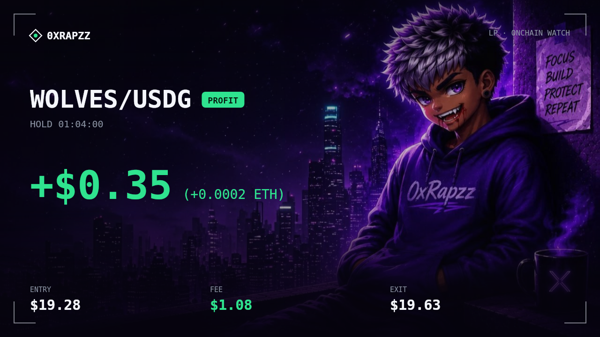
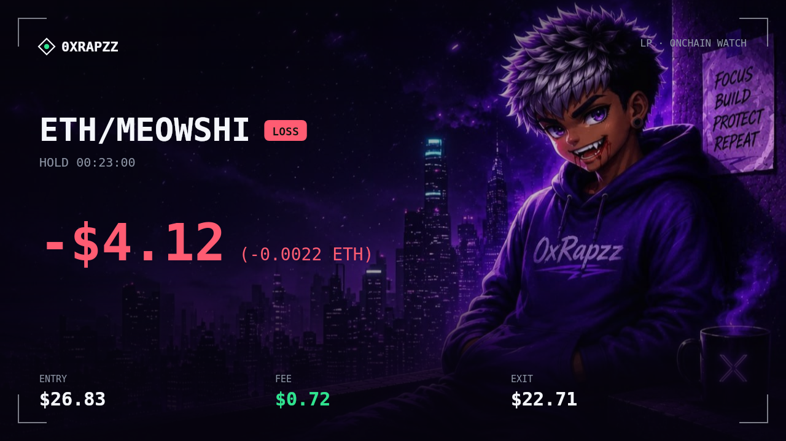
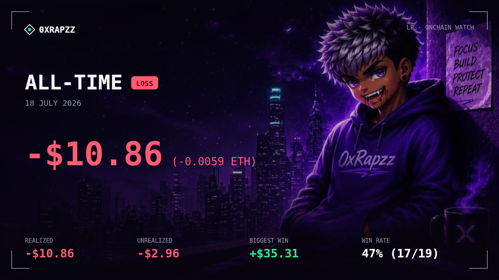

<div align="center">

# 🐷 Robinhood LP Bot v2


<br>


**Automated liquidity provision on Uniswap v2 · v3 · v4 (Robinhood Chain) — fully controlled from Telegram.**

Paste a CA → pick a pool → type an ETH amount → position opened. Right now.

[](README.md) [](README.en.md)

</div>

---

## About

**Robinhood LP Bot v2** is a liquidity-provider bot for **Robinhood Chain**, driven entirely from Telegram. Paste a contract address → the bot finds the deepest pool across **Uniswap v2 / v3 / v4** (including **USDG** pairs), buys the token through the **KyberSwap aggregator** (best route across every DEX/fee-tier, minimal price impact), then opens an LP position. All tick/price math goes through the **official Uniswap SDK** — zero precision drift, no hand-rolled `Math.pow`.

On top of the LP sits a **detection + screening** layer:

- **On-chain volume scanner** — finds tokens whose volume is *rising*, not merely high.
- **Real-time Nitro sequencer feed** — sub-second new-token detection, before DexScreener indexes it.
- **Self-run honeypot test** — simulates buy→sell via the Quoter; trusts no one's reputation.
- **GMGN 24h screening** (`/screen`) — thesis filter: mcap > $500k, vol > $1M, no flap.fun, utility over meme.
- **LLM scoring** (OpenRouter/gateway) — a `🟢 APE / 🟡 WATCH / 🔴 SKIP` verdict attached to every candidate alert.

…and an **automated farming** layer (new):

- **Candidate hunter** (`/hunt`) — every 3 min: scan GMGN trending → screen → keep only tokens that have a **busy 3-5% fee pool**, ranked by **fee-yield** (`vol × fee%`), inside a **market-cap band** you set (small-cap = bigger fee share for small capital).
- **Auto-farming** (`/auto`) — auto-**add** candidates that clear the gate + auto-**close** by TP / SL / out-of-range. Mode `single` (park the quote asset, rug-safe) or `inrange` (both-sided, fee immediately) — switchable live.
- **Reuse USDG + sweep back to ETH** — if you already hold USDG it isn't re-swapped; every close sweeps proceeds back to ETH (wallet stays clean, gas tops up).
- **Shareable profit cards** — every close auto-generates a flex PNG (STRIX aesthetic).

Written in modular TypeScript with **owner-only auth**, a slippage floor on every swap, atomic ledger writes, graceful shutdown, a single-instance lock, and **serialized wallet transactions** (no nonce collisions). Runs on a laptop or a 24/7 VPS.

---

## 📸 Profit cards (auto on every close)

Every time a position closes, the bot sends a share-ready PNG to Telegram. There's also a **portfolio** card (`/card`) for the full recap, plus **per-position** cards from `/ledger`.

**Per-close — PROFIT**



**Per-close — LOSS**



**Portfolio — ALL-TIME** (`/card`)



> Swap the background: send a photo to the bot (set instantly as the card bg) or drop `assets/card-bg.jpg`. Default brand is `0xRapzz` — change it with `RH_CARD_BRAND`, the tagline with `RH_CARD_TAG`. The monospace font (DejaVu Sans Mono) is bundled on the VPS.

---

## Telegram menu

Send `/start` → a persistent button menu (reply keyboard) appears, every function one tap away:

|  |  |  |
|:--|:--|:--|
| 📋 **Positions** — `/list` | 📒 **Ledger** — `/ledger` | 💰 **PnL** — `/pnl` |
| 🧪 **Screen** — `/screen` | 🔍 **Scan** — `/scan` | 📸 **Card** — `/card` |
| 🔄 **Swap** — `/swap` | 📡 **Feed** — `/feed` | 👁 **Watch** — `/watch` |
| 🤖 **Auto** — `/auto` | 👛 **Wallet** — `/wallet` | ⚙️ **Settings** — `/settings` |
| 🗑 **Close All** — `/closeall` | 💸 **Sell** — `/sell` | ❔ **Help** — `/help` |

---

## Log output

Clean, timestamped, per-module. Example boot + runtime:

```
[10:01:45] INFO  client   · fast-submit ON → sequencer.mainnet.chain.robinhood.com
[10:01:45] INFO  bot      · Robinhood LP Bot v2 running — chain 4663, wallet 0xc017…469e
[10:01:45] INFO  watch    · ON — scan every 120s (vol5m ≥ $200k, up 1.4×)
[10:01:45] INFO  feed     · connect feed.mainnet.chain.robinhood.com
[10:01:45] INFO  feedmon  · ON — newToken=true positionMonitor=true autoClose=false
[10:01:45] INFO  feed     · connected (101)
[10:02:02] INFO  feedmon  · new token NUG rejected: CANNOT SELL (sim revert) — honeypot
[10:14:07] INFO  v4close  · close v4 #177922 WOLVES/USDG — +$0.35 (fee $1.08)
[10:14:08] INFO  card     · close card sent
```

On the VPS: `pm2 logs robinhood-lp`.

---

## Why this bot exists

Three things make manual LP annoying:

1. **The Uniswap web app lags** — connect, approve, set range, mint. Each step loads.
2. **The range is alien** — Uniswap gives you `tick 130400–134400`. What does that mean?
3. **Open — am I up?** — you only see "unclaimed fees". What was the entry cost? What's it worth now? Unclear.

This bot answers all three. Range is shown in **MCAP** (`$2.64M → $3.94M`), PnL is computed from the **actual exit price**, and everything happens from Telegram.

---

## Setup (5 minutes)

**Requires:** Node.js 20+ ([download](https://nodejs.org))

```bash
# 1. Enter the folder
cd Robinhood-LP-Bot

# 2. Install (pulls ethers v6 + @uniswap/{v3,v4}-sdk + @napi-rs/canvas + typescript)
npm install

# 3. Prepare config
cp .env.example .env
```

Now open `.env` and fill in:

| What | Where to get it |
|---|---|
| `RH_RPC_URL` | [alchemy.com](https://alchemy.com) → create app → pick chain **Robinhood** → copy the HTTPS URL |
| `RH_WALLET_KEY` | Your EVM wallet private key. **Use a fresh/burner wallet**, not your main |
| `RH_TG_TOKEN` | Chat [@BotFather](https://t.me/BotFather) on Telegram → `/newbot` → copy the token |
| `RH_TG_CHAT` | **Owner chat id — THE SECURITY GATE.** Chat [@userinfobot](https://t.me/userinfobot) for your id. Only this chat can command the bot |
| `RH_WATCH_RPC_URL` | (optional) a second Alchemy app for the scanner. Leaving it blank is fine |
| `RH_OPENROUTER_KEY` | (optional) [openrouter.ai/keys](https://openrouter.ai/keys) — enables the LLM radar |
| `KYBERSWAP_*` | (optional) KyberSwap aggregator endpoint — for best-route swaps (see `.env.example`) |

Generate a fresh wallet quickly:
```bash
node -e "const w=require('ethers').Wallet.createRandom();console.log('Address:',w.address);console.log('Key    :',w.privateKey)"
```

Fund it with ETH on **Robinhood Chain** (bridge from mainnet). Keep at least `0.015 ETH` for gas.

**Run it:**
```bash
npm start        # = node --env-file-if-exists=.env --import tsx src/index.ts
```

Open your bot in Telegram, send `/start`. If it replies, you're set.

> Type-check: `npm run typecheck` · dev auto-reload: `npm run dev`

---

## Usage

### Open an LP position

1. **Paste the token CA** (`0x…`) into the chat
2. The bot finds pools across **v2 / v3 / v4** (labeled `ETH ✅` / `USDG ✅`) → pick one
3. Type the ETH amount (e.g. `0.05`)
4. Pick a mode:

```
🛡 Single-side ETH — range $2.64M → $3.94M
   0% token. Fees only accrue when MCAP is in range. Rug-safe.

🎯 In-range — range $3.35M → $5.00M
   buys ~51% of capital → token first (via Kyber, best route).
   Fees accrue immediately, but you hold the token now (rug = 51% instant loss).
```

**The difference matters — read this:**

| | 🛡 Single-side | 🎯 In-range |
|---|---|---|
| Initial position | 100% ETH | ~49% ETH + ~51% token |
| Fees | wait for price to enter range | accrue from second 1 |
| If the token rugs | small loss (not converted yet) | **~51% instant loss** |

Uniswap can't build a range that straddles the price with a single token, so "in-range" means the bot **buys the token first** (through the KyberSwap aggregator → cheapest route, not the high-fee pool you picked). Use it for tokens with deep pools. Sketchy tokens → stay single-side.

### Check positions — `/list`

```
📋 LP Positions · ETH $1844 · 09.44.49

🐷 DATABEAR  ·  fee 1.00%  ·  #86566
   🟢 IN RANGE
   entry     0.060000Ξ    $108.66
   value     0.073289Ξ    $132.74
   fee       0.016264Ξ     $29.46
   age             36m  $48.02/hr
   MCAP         $3.28M  entry $4.20M
   range   $2.69M → $4.02M
   PnL      +0.013289Ξ    +$24.07  +22.1%

🦄 UNISWAP v4 · 2 positions
   ...
💧 UNISWAP v2 · 1 position
   ...

TOTAL 4 positions  ·  v3 1 · v4 2 · v2 1
entry   0.128000Ξ    $236.03
value   0.141813Ξ    $261.50
fee     0.017640Ξ     $32.53
PnL    +0.013813Ξ     +$25.47
```

**`$/hr` is the most useful number here.** Age alone doesn't help. What you want to know: is this position still working or idle?

- `3h 20m · $2.10/hr` → still productive, leave it
- `2d 5h · $0.04/hr` → dead, capital stuck for nothing → close it, rotate to another pool

The TOTAL (v3+v4+v2 combined) always sits at the very bottom. The 🔄 **Refresh** button fetches fresh data; a plain `/list` is served from a 20-second cache (so it's instant). Each token has a **Close** / **💰 Claim** button.

### Close a position

Tap close → choose:
- **🔄 Swap token → ETH** — everything back to ETH
- **🪙 Keep token** — LP principal back to ETH, you hold the token

The bot handles: withdraw liquidity → claim fees → burn the NFT → (swap) → **top gas back up to 0.015 ETH** → send a **profit card**.

For honeypot tokens that can't be withdrawn (transfer reverts), the bot **force-closes**: forfeits the stuck token side and **salvages the ETH**.

> ⚠️ **Note on "Keep token":** the auto-swap on close sweeps your **entire wallet balance of that token**, not just this position's share.

### ➕ Add to an existing position (increase)

Already have a position (e.g. USDG/TACO) and want to **top it up**? In `/list` every v4 position has an **➕ Add** button → type an ETH amount → the bot **swaps ½ token + ½ USDG** and adds it to the **SAME position** (not a new NFT — the SDK emits `INCREASE_LIQUIDITY`). Uses the existing range, grows the PnL basis (LP-vs-HODL stays honest), reuses wallet USDG + sweeps the leftover → ETH. (USDG pairs for now; ETH pairs to follow.)

### History — `/ledger`

Every closed position (v3 + v4 + v2, newest first), with Next/Back buttons + a 📸 card per position. Combined stats: win rate, capital, LP fees, realized vs stuck.

### 📅 Profit Calendar — `/calendar`

A monthly calendar grid (PNG) — each cell = the **realized PnL of positions closed that day** (LP-vs-HODL, **fees included**). Green profit, red loss, header "X up · Y down" + monthly total. **⬅️ Prev / Next ➡️** buttons switch months. Day boundary **00:00 UTC = 07:00 WIB**. Background is customizable (send a photo to the bot / `assets/card-bg.jpg` / `RH_CARD_BG` — same as the profit cards).

The ledger is reconstructed from **on-chain events** — old positions still show up even if you just installed the bot. USDG pairs use **LP-vs-HODL** accounting (fees + IL, excluding the token's own price move) so the number stays consistent and honest.

### Swap — `/swap`

`/swap <amount> <from> <to>` — swap any token through the **KyberSwap aggregator** (best route across DEXs). `from`/`to` = `eth` or a CA. Shows quote + route breakdown + slippage → ✅ confirm button.

### Thesis screening — `/screen`

A GMGN 24h filter using the operator playbook: mcap > $500k, vol > $1M, **drop flap.fun**, **utility prioritized, meme penalized**, checks community + FOMO. The top 10 are LLM-scored. `/screen fast` = no LLM.

### Volume scanner — `/watch`

Runs automatically every 2 minutes. Looks for 5-minute volume that's **rising**, not merely high. Each token is honeypot-tested on-chain:

```
DATABEAR  sim buy 0.01Ξ → sell back 0.00980Ξ = 98.0%  ✅ healthy
honeypot  sim buy 0.01Ξ → REVERT                      🚨 rejected
```

Alerts carry the CA, a DexScreener link, and a one-tap **🎯 LP** button.

### Real-time sequencer monitor — `/feed`

Opt-in (off by default): `/feed on`. Listens to the **Nitro sequencer feed** (`wss://feed.mainnet.chain.robinhood.com/feed`) — sub-second mempool, **before** the tx lands in a block.

1. **🆕 New token** — detects a new WETH pool / first liquidity mint, instantly honeypot-tests it + a 1-tap LP button.
2. **🔴 Out-of-range** — a swap hits a pool you're LP'ing → check the tick → alert (optional auto-close, off by default).

> ⚠️ **DNS hijack:** if your network hijacks the feed domain's DNS (e.g. Telkomsel "Internet Baik"), set `RH_FEED_IP=172.66.147.70` in `.env`. Not needed on a US VPS. The sequencer lives in AWS Ohio (`us-east-2`).

Toggles: `/set newtoken 1` · `/set posmon 1` · `/set autoclose 0` · `/set minseed 0.02`

### Fast-submit — broadcast straight to the sequencer

Set `RH_FAST_SUBMIT=1`. Transactions go directly to the Robinhood sequencer (**AWS us-east-2 / Ohio**), skipping the relay hop. Reads still go through the main RPC; if the sequencer errors, it auto-falls back (no tx is lost). **Biggest impact on a US VPS.** Local + DNS hijack → set `RH_SEQUENCER_IP=3.136.74.196`.

> ⚡ **Fast receipt detection:** Robinhood blocks are sub-second, but ethers polls for receipts every 4s by default → a multi-tx close/add/swap feels slow. The bot sets `pollingInterval` to **350ms** (tunable via `RH_POLL_MS`), so `tx.wait()` returns ~10× faster.

### LLM + GMGN radar — candidate confirmation layer

Every candidate (a new token from the feed / a spike from watch) is **LLM-scored via OpenRouter** + enriched with **GMGN** data (smart money, holders, rug ratio, tax, top-10 concentration). The verdict (`🟢 APE / 🟡 WATCH / 🔴 SKIP` + score + reason) is attached to the alert before you tap LP.

```
# enable
RH_OPENROUTER_KEY=...        # openrouter.ai/keys
/set radar 1                 # in Telegram
```

GMGN (optional enrichment): install `gmgn-cli` + config on the machine running the bot (the GMGN key binds to the local keypair — see `.env.example` §9). GMGN supports the `robinhood` chain. Not configured → the radar still runs on LLM + on-chain data alone (graceful degrade).

> Everything is best-effort: fast-submit / radar / GMGN / Kyber disable themselves if their env/tool is missing — the core bot keeps running.

---

## Auto-farming — hunter + auto-add + auto-close (`/hunt` · `/auto`)

The top layer: the bot **finds, opens, and closes positions on its own** — you just set the gates.

**1. Hunter (`/hunt`)** — every 3 min: `100 trending → screening (thesis + LLM) → only tokens with a BUSY 3-5% fee pool → candidates`. Quality gates (all tunable via `/set`):

- **Fee-yield** — pools are ranked by the fees they actually generate (`vol24h × fee%`), not raw volume. A 5% pool @ $8k vol beats a 3% pool @ $9k.
- **Market-cap band** — only tokens in the range you want. Small-cap = your small position is a **bigger share of fees**.
- **OOR cooldown** — a token that keeps opening/closing out-of-range (never fills) gets temporarily blacklisted → stop burning gas.

**2. Auto-add** — candidates that clear the gate + verdict (`requireAction` ≥ `watch`, score ≥ `alpscore`) are opened automatically. Layered gates: source, LLM verdict, GMGN honeypot/tax, liquidity, **1 token = 1 position** (no dupes), concurrent/hourly/daily caps, balance. Mode:

| | `single` (rug-safe) | `inrange` (aggressive) |
|---|---|---|
| Position | parks the quote asset (USDG/ETH) only | both-sided (buys the token too) |
| Fee | starts when price **enters** range | starts **immediately** |
| On rug | safe (0 token) | holds the token → loss |

`/set alpmode single` or `/set alpmode inrange` — live, no restart.

**3. Auto-close** — the manage loop checks every 90s: **TP** (PnL ≥ `alptp`%) · **SL** (PnL ≤ −`alpsl`%) · **OOR** (out of range > `alpgrace` min). PnL is measured **LP-vs-HODL** (fees + IL, consistent with what you realize at close), not the gross budget. Every close **sweeps proceeds → ETH** (token + USDG sold back), wallet clean + gas refilled.

> ⚠️ **Spends REAL funds with no human confirmation.** OFF by default (`/auto on` to enable). Caps are conservative; raise them deliberately via `/set alp*`. Wallet transactions are serialized (one sequence at a time) to avoid nonce collisions.

---

## All commands

| Command | Function |
|---|---|
| paste `0x…` | Open an LP position (v2/v3/v4, auto pool detection) |
| `/list` | Open positions (v3+v4+v2) + PnL + TOTAL + close buttons |
| `/ledger` | Closed-position history (realized vs stuck) + per-position cards |
| `/pnl` | Lifetime wallet-level PnL |
| `/card` | Portfolio profit card (shareable PNG) |
| `/calendar` | 📅 Profit calendar — daily PnL (monthly grid, fees included) |
| `/swap` | Swap tokens via the KyberSwap aggregator (best route) |
| `/screen` | GMGN 24h screening (mcap>500k, vol>1M, no flap, utility>meme) · `/screen fast` |
| `/watch` | Scanner status + current top volume |
| `/feed` | Real-time sequencer monitor · `/feed on`/`off` |
| `/scan` | Check volume right now (manual) |
| `/hunt` | Candidate hunter (fee 3-5% + busy tx + screening) |
| `/auto` | Auto-farming: auto-add + auto-close · `/auto on`\|`off` · `/auto tp 100` · `/auto sl 30` · `/auto oor on`\|`off` |
| `/v4` | Inspect a token's Uniswap v4 pools by CA |
| `/closeall` | Close ALL positions |
| `/sell` | Sell all stuck tokens → ETH |
| `/wallet` | Hot-wallet balance |
| `/settings` · `/set <key> <value>` | View / change settings |

**Adjustable settings** (all live — `/set` applies immediately, no restart):
```
LP      : /set width 50 · /set slippage 5 · /set gastarget 0.015

Scanner : /set vol5m 500000 · /set rise 1.4 · /set liq 50000 · /set tax 6
          /set cooldown 60 · /set interval 120

Hunter  : /set huntvol 15000       min pool 24h volume (USD)
          /set huntfees 400        min pool 24h fees = vol × fee% (fee-yield)
          /set huntyield 0         min daily fee/TVL yield % (0 = off; v4 TVL often reads $0)
          /set huntscore 55        min screening score
          /set huntmcapmin 100000  ·  /set huntmcapmax 5000000   mcap band (max 0 = no ceiling)

Auto-LP : /set alpmode single|inrange   single (rug-safe) / inrange (fee immediately)
          /set alpsize 0.0025      ETH per position
          /set alpscore 60         min score to AUTO-add (separate from huntscore)
          /set alpmaxopen 5        max concurrent positions
          /set alpperhour 4        ·  /set alpdaily 0.2          open/hour & ETH/day caps
          /set alpminliq 1000      min liquidity (0 = rely on fee-gate; useful for small-cap v4)
          /set alpgrace 30         minutes OOR before auto-close
          /set alpclose 1          toggle auto-close OOR (0/1)
          /set alpoorcount 3  ·  /set alpoorhours 12   OOR cooldown: N× OOR → blacklist X h

Auto-close (via /auto): /auto tp 100  ·  /auto sl 30  ·  /auto oor on|off
Feed    : /set newtoken 1 · /set posmon 1 · /set autoclose 0 · /set minseed 0.02
Radar   : /set radar 1 · /set gmgn 1
```

---

## Run 24/7 on a VPS

```bash
npm install -g pm2
pm2 start npm --name robinhood-lp -- start   # npm start reads .env itself
pm2 save
pm2 startup        # follow the printed instructions → auto-start after reboot
```

Check: `pm2 logs robinhood-lp`

> Profit cards need fonts: `sudo apt install -y fonts-dejavu-core fonts-dejavu-extra` (canvas renders blank text without them).

> ⚠️ **Don't run it in two places at once.** Two processes polling the same Telegram token will collide (`409 Conflict`). v2 has a **single-instance lock** (`data/bot.lock`). If you share a wallet with another bot → **don't run them together** (nonce collision).

---

## Code structure (`src/`)

```
src/
├── index.ts              entrypoint — validate secrets, lock, graceful shutdown
├── config.ts             load + validate config (zod) + secrets from .env
├── types.ts              shared domain types
├── chain/                everything blockchain
│   ├── client.ts         providers (LP + watch), wallet, gas, fast-submit routing
│   ├── kyber.ts          KyberSwap aggregator (quote + build, 4 security gates)
│   ├── positions.ts      v3 open / list / close + USDG single-side & in-range (Uniswap SDK math)
│   ├── pools.ts          findPools, poolState, range math (SDK)
│   ├── swaps.ts          quote + swap v3 (slippage floor)
│   ├── candidate.ts      qualifyCandidate — 3-5% pool + fee-yield gate (hunter)
│   ├── dexscreener.ts    pool volume/liquidity (cached) — fee-farming signal
│   ├── txlock.ts         wallet-tx serializer (no nonce collisions)
│   ├── ledger.ts         permanent ledger + on-chain rebuild
│   ├── analytics.ts      lifetime PnL
│   ├── tokens.ts         token metadata (cached) + SDK Token
│   ├── price.ts          ETH/USD multi-source
│   ├── blockscout.ts     Blockscout REST helper + mapLimit
│   ├── v2/               Uniswap v2 — pair.ts · mint.ts (zap) · list.ts · close.ts
│   └── v4/               Uniswap v4 — discover · mint (single/in-range + reuse USDG) · list (LP-vs-HODL PnL) · close (sweep→ETH) · backfill
├── telegram/
│   ├── tg.ts             transport + AUTH boundary (owner-only)
│   ├── bot.ts            long-poll loop + routing + setMyCommands
│   ├── handlers.ts       all commands/buttons (+ /list cache)
│   ├── menu.ts           persistent reply keyboard
│   ├── card.ts           profit card PNG (@napi-rs/canvas, STRIX style)
│   ├── calendar.ts       monthly profit calendar (daily PnL, PNG) + custom bg
│   ├── notify.ts         spike / new-token / out-of-range alerts
│   ├── watchLoop.ts      scanner timer
│   ├── feedLoop.ts       feed monitor lifecycle
│   └── format.ts         escape, padding, per-token emoji
├── feed/                 real-time sequencer monitor (Nitro)
│   ├── decode · listener (WS + IP-pin) · swapdecode · lpdecode · monitor
├── radar/                screening + auto-farming
│   ├── openrouter.ts · gmgn.ts · screen.ts (/screen thesis) · radar.ts (LLM+GMGN verdict)
│   ├── scanLoop.ts       hunter (/hunt) — trending → screen → 3-5% candidates
│   ├── autolp.ts         auto-add: gate chain + open (1 token/position dedup + txlock)
│   ├── automanage.ts     auto-close TP/SL/OOR (restart-proof grace)
│   └── oorcool.ts        OOR cooldown (blacklist tokens that never enter range)
├── watch/scanner.ts      volume scan + on-chain honeypot test
└── util/                 log, atomic file write + lock, formatters
```

| Other file | What's in it |
|---|---|
| `config.json` | Settings (zod-validated at start) |
| `.env` | **The keys. Secret.** (gitignored) |
| `assets/card-bg.jpg` | Profit-card background (optional) |
| `data/` | Runtime state — `positions.json`, `v4-positions.json`, `lp-ledger.json`, `v2-skip.json`, `bot.lock`. **Don't delete** — your PnL history lives here. (gitignored) |

Writes are atomic (temp + rename), so a crash mid-write won't corrupt the ledger.

---

## Things to be aware of

**This is a degen tool, not an investment.** LP'ing a meme token makes you an automatic buyer as its price falls. That's not a bug, it's how LP works.

**The honeypot test catches honeypots & tax — NOT rugs.** A dev who pulls liquidity tomorrow still passes today's test. No test can see the future.

**Single-side is your natural brake.** In-range mode releases that brake (you hold the token → exposed to rugs). Choose consciously.

**Auto-farming spends REAL funds, no questions asked.** `/auto on` lets the bot open + close positions with your money. OFF by default, conservative caps — but you set them, so raise them deliberately.

**PnL in `/list` = LP-vs-HODL** (fees + impermanent loss), not your absolute wallet change. It measures how the LP itself performs (fees vs IL), consistent with what you realize at close. The token's directional price move is separate market risk.

**Use a burner wallet.** The private key sits in `.env` in plaintext. Don't put in money you're not ready to lose.

**Set `RH_TG_CHAT`.** It's the owner gate — only your chat can command the bot. The bot holds a private key; don't let anyone `/closeall` or mint with your money.

---

MIT. Use at your own risk.
